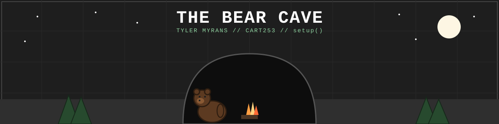
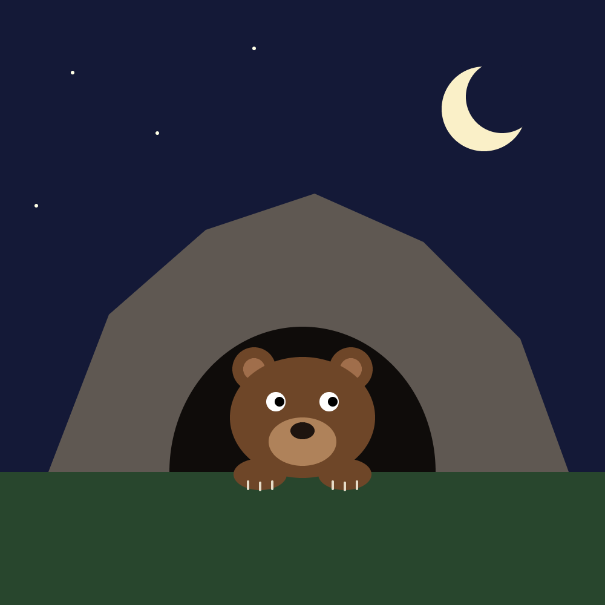
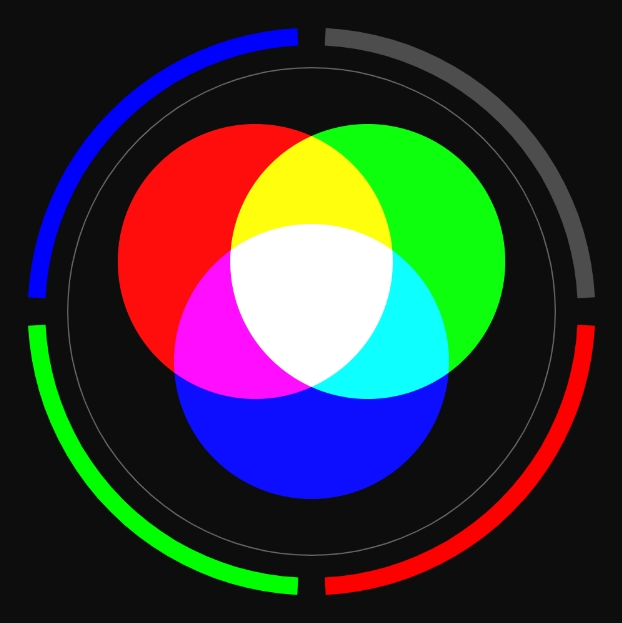
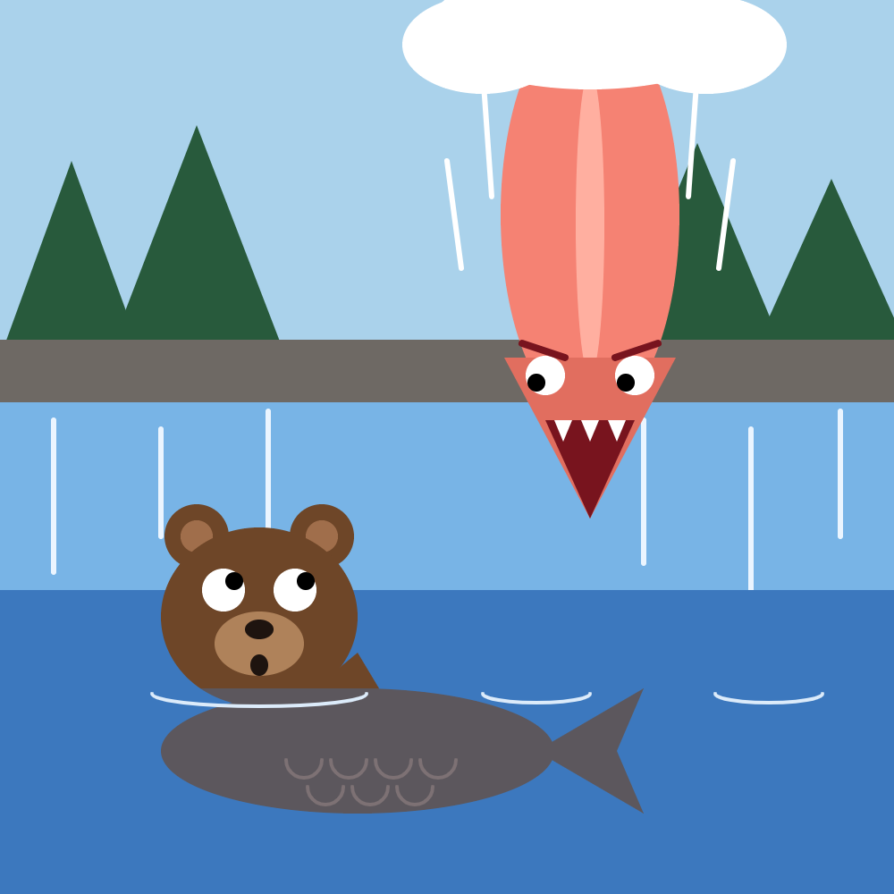
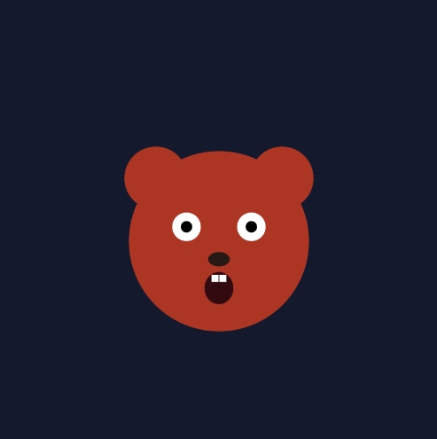
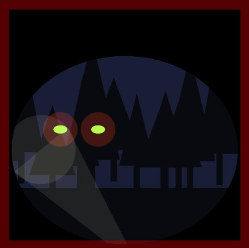
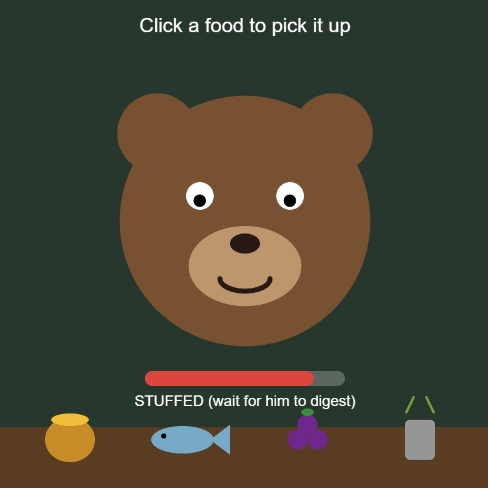
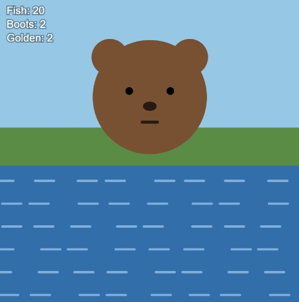
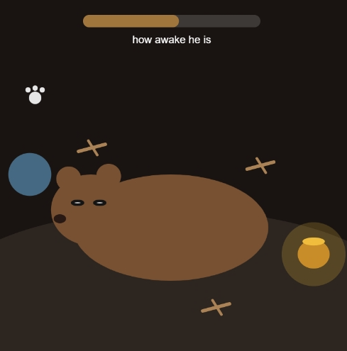

# The Bear Cave

Welcome to my den. This site collects together and shows off the prototyping work I'm doing for CART253  every project, sketch, and experiment I build over the course of the semester lives here.

## Links

- [Reflective Journal](./journal.md)

## Prototypes
### Prototyping: Instructions

#### Bear Cave

[View it running](https://imbear001.github.io/CART253/prototypes/instructions/bear-cave/) | [See the code](https://github.com/ImBear001/CART253/tree/main/prototypes/instructions/bear-cave)

#### Additive Light

[View it running](https://imbear001.github.io/CART253/prototypes/instructions/additive-light/) | [See the code](https://github.com/ImBear001/CART253/tree/main/prototypes/instructions/additive-light)

#### Upside Down Catch

[View it running](https://imbear001.github.io/CART253/prototypes/instructions/upside-down-catch/) | [See the code](https://github.com/ImBear001/CART253/tree/main/prototypes/instructions/upside-down-catch)

#### Journal

[Process journal entry: Prototyping Instructions](journal.md#prototyping-instructions)

## Prototyping: Variables

Three small prototypes set in the bear theme, each exploring how variables can change a program while it runs.

### Breathing Bear

A bear breathing with `sin()`. Move the mouse right and he panics: faster, deeper breaths, a red face, wide eyes and a shocked mouth.

- [Run it](https://imbear001.github.io/CART253/prototypes-variables/breathing-bear/)
- [Code](https://github.com/ImBear001/CART253/tree/main/prototypes-variables/breathing-bear)

### Night in the Cave

Dusk fades to night, the stars come out and the sky slowly turns. The mouse is the moon: bring it close and the bear's eyes glow from inside the cave.

- [Run it](https://imbear001.github.io/CART253/prototypes-variables/night-in-the-cave/)
- [Code](https://github.com/ImBear001/CART253/tree/main/prototypes-variables/night-in-the-cave)

### Something's Out There

You're the bear, looking out of the cave. Eyes creep closer through the trees, and your flashlight (the mouse) pushes them back. Your heartbeat pulses at the edges as they get closer.

- [Run it](https://imbear001.github.io/CART253/prototypes-variables/somethings-out-there/)
- [Code](https://github.com/ImBear001/CART253/tree/main/prototypes-variables/somethings-out-there)

### Journal
- [Journal entry: Prototyping Variables](journal.md#prototyping-variables)

## Prototyping: Conditionals

Three Bear Cave prototypes, each using conditionals to give the bear choices, luck, and consequences.

### Picky Bear

Pick up a food from the table and feed it to the bear. He reacts differently to each one: he loves honey, likes fish, isn't sure about berries, and is grossed out by garbage. Feed him too much and he gets stuffed, so you have to wait for him to digest.

- [Run it](https://imbear001.github.io/CART253/prototypes-conditionals/picky-bear/)
- [Code](https://github.com/ImBear001/CART253/tree/main/prototypes-conditionals/picky-bear)

### Lucky Catch

Click to swipe the bear's paw into the river. A random roll decides what comes out: a fish, a boot, nothing, or a rare (about 1 in 30) golden salmon. His face changes with each catch, and he gets grumpy after a long dry streak.

- [Run it](https://imbear001.github.io/CART253/prototypes-conditionals/lucky-catch/)
- [Code](https://github.com/ImBear001/CART253/tree/main/prototypes-conditionals/lucky-catch)

### Don't Wake Him

Sneak in, grab the sleeping bear's honey, and bring it back to the start circle. Moving fast, stepping on sticks, or moving while he's peeking all disturb him. Fill his meter and you get caught.

- [Run it](https://imbear001.github.io/CART253/prototypes-conditionals/dont-wake-him/)
- [Code](https://github.com/ImBear001/CART253/tree/main/prototypes-conditionals/dont-wake-him)

### Journal
- [Journal entry: Prototyping Conditionals](journal.md#prototyping-conditionals)