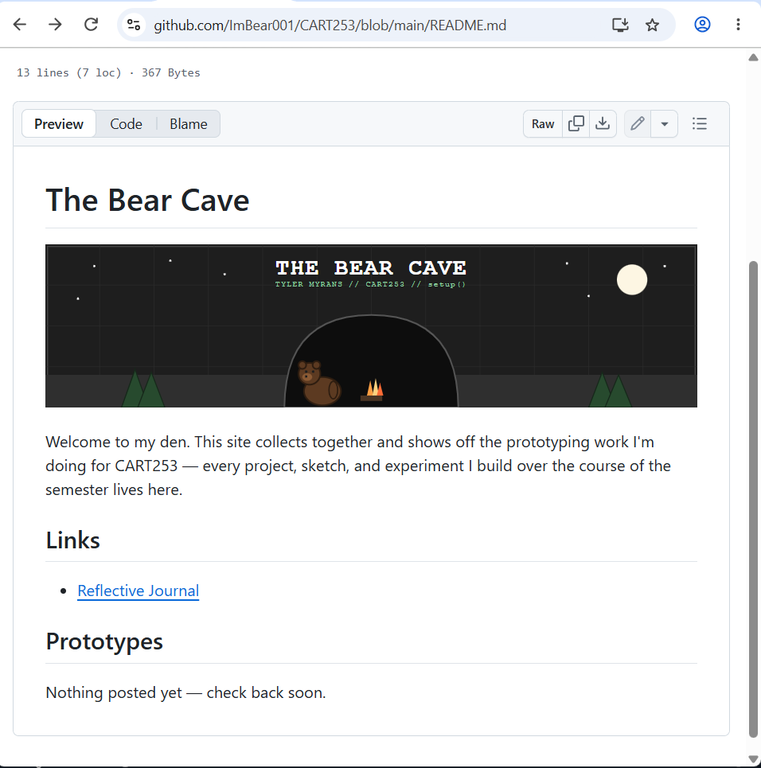
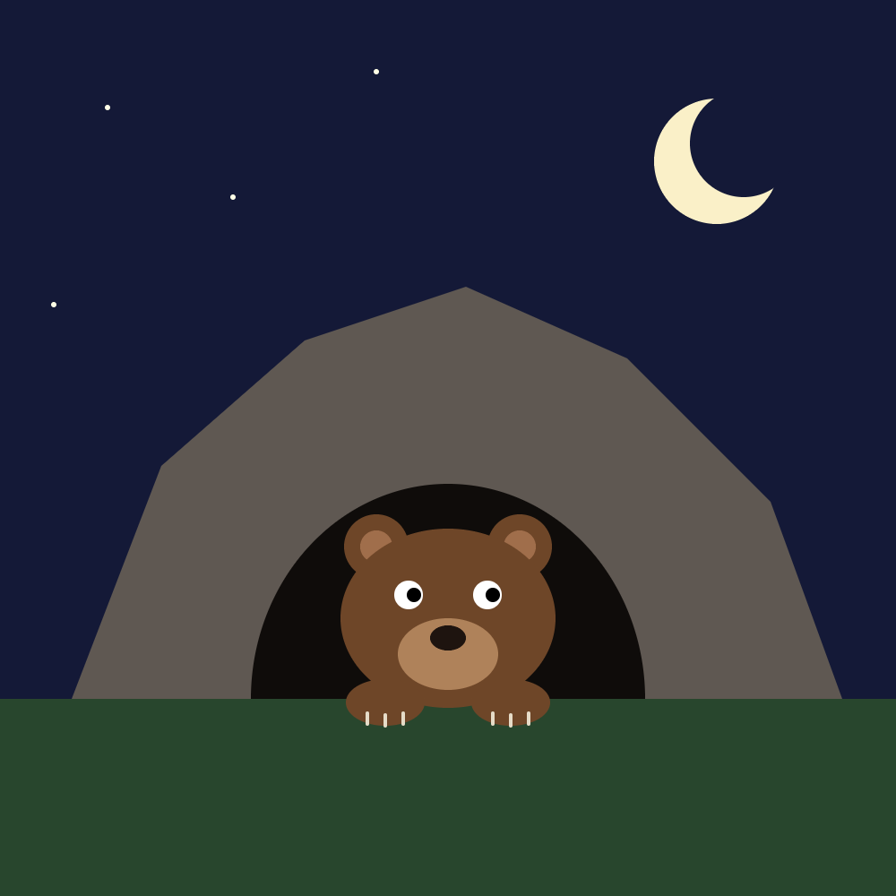
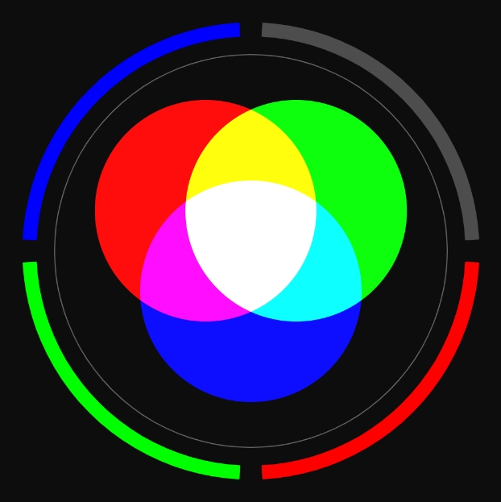
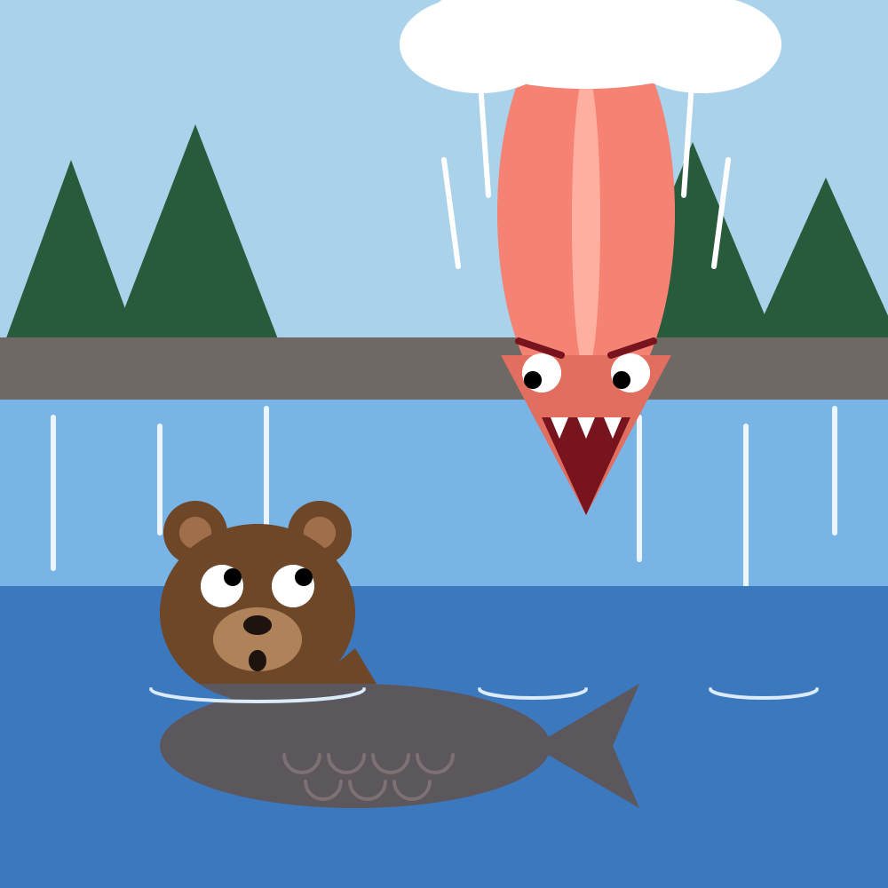

# Reflective Journal

## September 17, 2026

I'm still getting used to building a website with just Markdown and GitHub , no drag-and-drop, no visual editor, just plain text files and a folder structure that has to be exactly right or nothing shows up where it should. What surprised me most is how much of "web development" at this level is really just file management and syntax: a few characters like `#` or `` completely change how a page looks once GitHub renders it.

The part I find genuinely cool is seeing a plain text file turn into a formatted, styled page the moment it's pushed , there's something satisfying about writing `# The Bear Cave` and watching it become a real heading on a live URL anyone can visit. The hardest part so far has been keeping track of *where* I am in the folder structure , VS Code, GitHub Desktop, and the actual live site all show slightly different views of the same project, and it's easy to lose track of whether I'm editing the right file in the right place.

I hope future visitors to this site get a sense of my process, not just finished work , the messiness of learning something new alongside the polish of what I eventually build. My aspiration for this course is to get comfortable enough with this workflow that it stops feeling like a chore and starts feeling like a sketchbook: a place I actually want to keep adding to.

Screenshot of the site so far:

## September 24, 2026

### Prototyping: Instructions

This week I made three prototypes: Bear Cave (a bear peeking out of a cave at night), Additive Light (red, green and blue circles that mix like real light), and Upside Down Catch (a giant salmon diving out of the sky to eat my bear, who's now a bear-fish). I wanted them to feel connected, so the same bear shows up in two of them.

What surprised me most is how much you can fake. There's no moon function, so I made a crescent by covering a circle with another circle the same colour as the sky. The coolest moment was blendMode(ADD), when three coloured circles turned white in the middle. I didn't expect that at all.

Honestly, a lot of it was annoying. Finding coordinates is just guessing, saving, and guessing again. Pippin's comment in the cat example about the ears being "truly hellish" is so real. PI and TWO_PI for arcs didn't make sense until I just tried numbers, and I still don't fully get how bezier() control points pull the curve. I also forgot that draw order matters, so the bear's ears ended up on top of his head at first. On top of that, my template folder ended up nested one level too deep and OneDrive locked a folder so I couldn't rename it, which ate a lot of time for no reason.

My first idea for the weird one was a messed-up face, but it was too close to the cat example, so I changed it. I hope people see a little story instead of three random drawings. Upside Down Catch looks like a frame from a game, and I'd like to make the salmon actually fall when you click and have you steer the bear-fish out of the way.